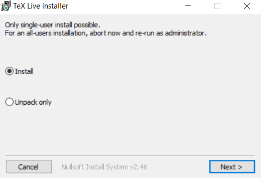
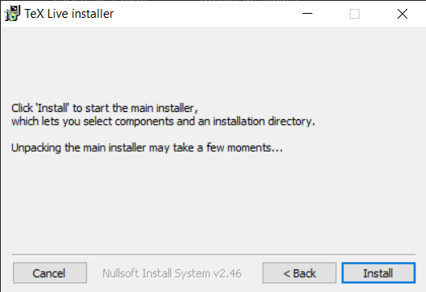
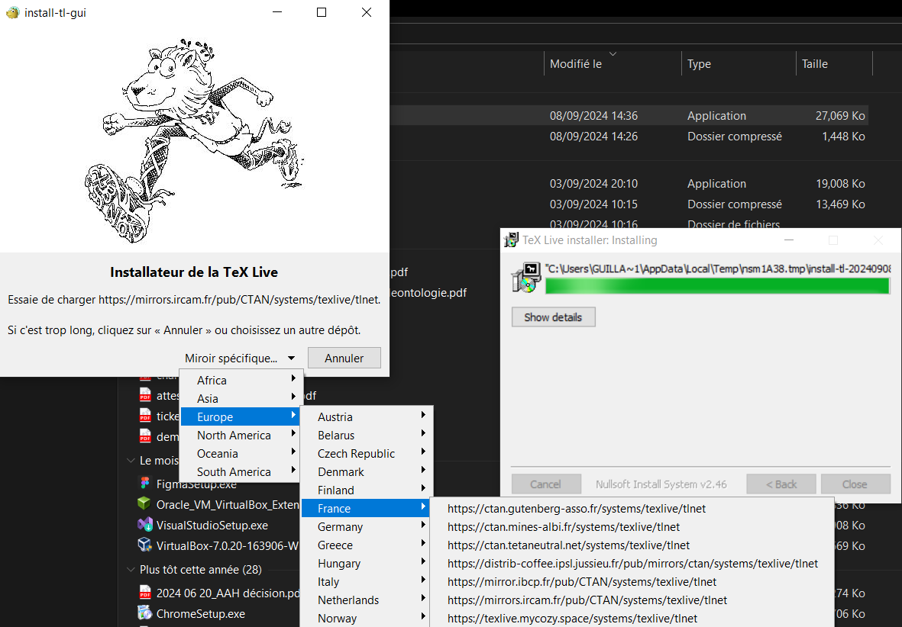
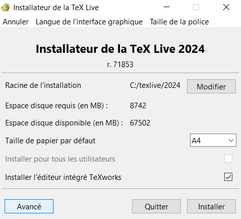
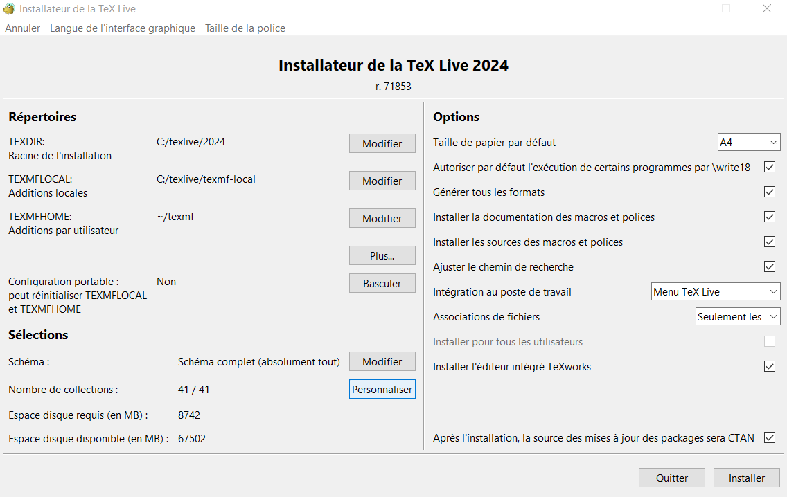
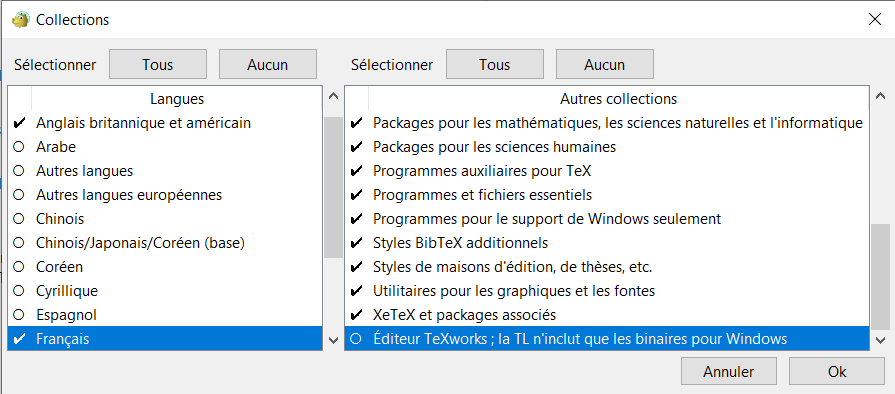
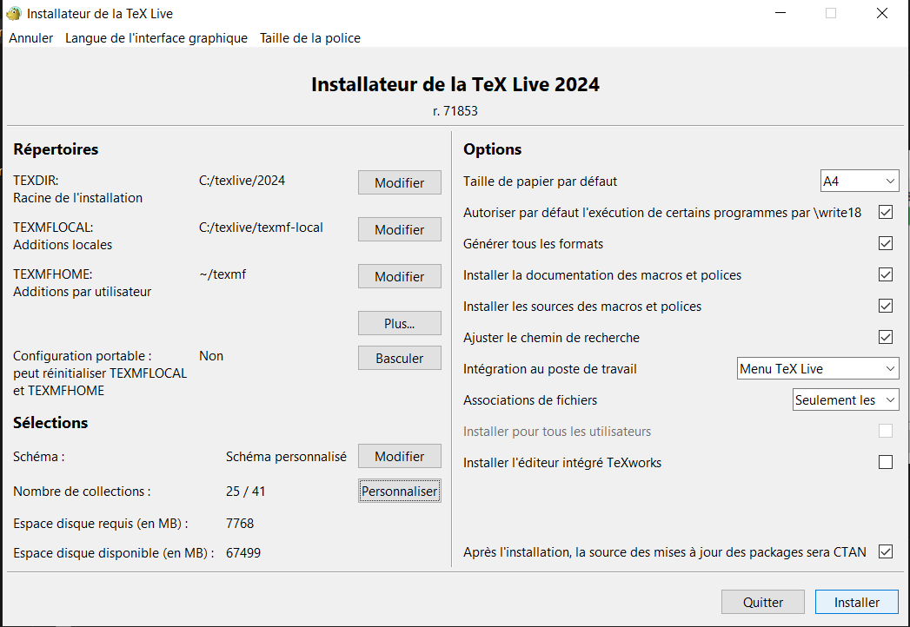

:toc:
:listing-caption: Code
= Lmake script setup
Latex make script setup instructions.

== Software installation
TIP: The setup procedure is quite long. If you wish to try and see the script working you might want to ask a friend to showcase it to you before following this setup procedure.

WARNING: All the given paths here need to be modified. The part to edit is place in dedicated "code" block to highlight it. Failing to do so will result in errors.

=== TeX Live
This script relies on link:https://www.tug.org/texlive/[TeX Live] which is a latex compiler for windows. The setup is very long and can fail at any time (2hours+ download time, mirror can fail anytime). However this distribution works very well on Windows and is the simplest to use compared to other compilers. +
You can download TeXLive using the "easy installer" link:https://www.tug.org/texlive/windows.html#install[here].

.Run the installer

.Select install

[TIP]
--
To change mirror you will have to be fast. The popup is displayed for about 1 to 2 seconds. +
If you didn't have time to select the mirror, close the window and repeat this process from the beginning.
--

.Change the download mirror to increase speed

.Select "Advanced" settings

.Select "Personnalize" to remove useless content

.Select languages pack you need (unselect those you don't) and remove "TeXLive editor"

.Change the default path where TeXLive will be download (e.g. "TEXDIR", if you want) and click on "Install"

=== Python and Git
You will need at least link:https://git-scm.com/downloads[Git] and link:https://www.python.org/[Python] to use this software. You could get through without Git but we don't provide documentation/support if you choose to follow this step. +
When installing those two tools please select the "Add to path" option (name might differ).

== Lmake setup
=== Repository initilization
Open a command interface with the path set to this this repo and run those commands:
.Commands in order to setup repo
----
pip install -r requirements.txt
git submodule update --init --recursive
----

=== Environment variables setup
You'll need to setup those variables to use this script.

WARNING: You must add them to "System variables" and not to "User variables".

.Environment variables setup
[options="header,footer", cols="30%,70%"]
|=======================
|*Env variable name*    |*Value*
|Template               |`X:\Path\To\This\Repo`\lmake-template\
|Path (already existing)|`X:\Path\To\TeXLive`\bin\windows
|=======================

=== `lmake` command shortcut with Git
This will create an alias (command) called `lmake` that can be called directly in `Git bash` from anywhere and will execute this script.

Go to your user folder `C:\Users\YourUsername` and create a `.bashrc` file as well as a `.bash_profile`. +
Once done copy and paste the content below.

.`.bashrc`
----
#!/bin/bash
alias lmake="python `X:\Path\To\This\Repo`\lmake.py"
----

.`.bash_profile`
----
# generated by Git for Windows
test -f ~/.profile && . ~/.profile
test -f ~/.bashrc && . ~/.bashrc
----

=== Global command shortcut
If you don't want to use git bash you can set a global command shortcut (which is basically an environment variable).

WARNING: This might not be the safest way to do it and creating an alias would be better. Please submit your ideas to improve this document. If you are at risk please consider other options.

.Environment variable "shortcut"
[options="header,footer", cols="30%,70%"]
|=======================
|*Env variable name*    |*Value*
|lmake                  |python `X:\Path\To\This\Repo`\lmake.py
|=======================
You can call this command in any command prompt using `$lmake`

== VS-Code setup
=== Install required extensions
You'll need some extensions in vscode with some setup in order to do link:https://marketplace.visualstudio.com/items?itemName=valentjn.vscode-ltex[spellcheck] and link:https://marketplace.visualstudio.com/items?itemName=James-Yu.latex-workshop[compilation] in vscode.

TIP: `ltex` extension experience somes issues since summer 2024. Read this link:https://github.com/valentjn/vscode-ltex/issues/884[issue] and the answer of "tobiscode" to patch it.

=== Extension settings setup
In vscode press `ctrl + e` to open a search bar popup. +
Search for this item: `>Preferences: Open User Settings (JSON)`

Copy and paste the below code between the two brackets in the opened file.
[source, json]
----
    // Latex indent specific configuration
    "latex-workshop.formatting.latex": "latexindent",
    "latex-workshop.formatting.latexindent.path": "latexindent.exe",
    "latex-workshop.formatting.latexindent.args": [
        "-c",
        "%DIR%/",
        "-l",
        ".template/localSettings.yaml",
        "%TMPFILE%",
    ],
    // Lmake compilation toolchain
    "latex-workshop.latex.autoBuild.run": "onSave",
    "latex-workshop.latex.recipes": [
        {
            "name": "lmake",
            "tools": [
                "lmake"
            ]
        },
    ],
    "latex-workshop.latex.tools": [
        {
            "name": "lmake",
            "command": "lmake",
            "args": [
                "-c",
                "%DOCFILE_EXT%"
            ],
            "env": {}
        },
    ],
    // Ltex spell checking
    "ltex.completionEnabled": true,
    "ltex.language": "en-US",
    "ltex.latex.environments": {
        "cpp": "ignore",
        "python": "ignore",
        "bash": "ignore",
        "image": "ignore",
        "imaged": "ignore",
        "imageq": "ignore",
        "ctable": "ignore",
    },
    "ltex.latex.commands": {
        "cppi": "ignore",
        "pyi": "ignore",
        "bashi": "ignore"
    },
----

== Adding custom shortcuts
This is an example of bold/italic/underscore shortcut. You can choose to ignore, use them or create your owns. Feel free to edit this file.

In vscode press `ctrl + e` to open a search bar popup. +
Search for this item: `>Preferences: Open Keyboard Shortcuts (JSON)`

Copy and paste the below code between the two brackets in the opened file.
[source, json]
----
    {
        "key": "ctrl+B",
        "command": "editor.action.insertSnippet",
        "when": "editorLangId == latex && editorTextFocus",
        "args": {
            "snippet": "\\textbf{${TM_SELECTED_TEXT}$0}"
        }
    },
    {
        "key": "ctrl+I",
        "command": "editor.action.insertSnippet",
        "when": "editorLangId == latex && editorTextFocus",
        "args": {
            "snippet": "\\textit{${TM_SELECTED_TEXT}$0}"
        }
    },
    {
        "key": "ctrl+U",
        "command": "editor.action.insertSnippet",
        "when": "editorLangId == latex && editorTextFocus",
        "args": {
            "snippet": "\\underline{${TM_SELECTED_TEXT}$0}"
        }
    }
----

TIP: You might have custom keybindings linked to theses shortcuts. The one we setup will only take precedence in latex files. They won't override the previous shorcuts in other files type.